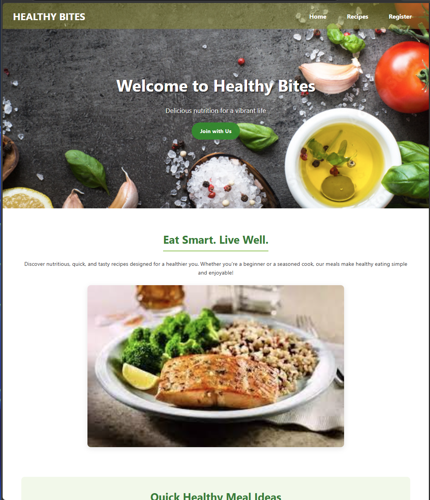
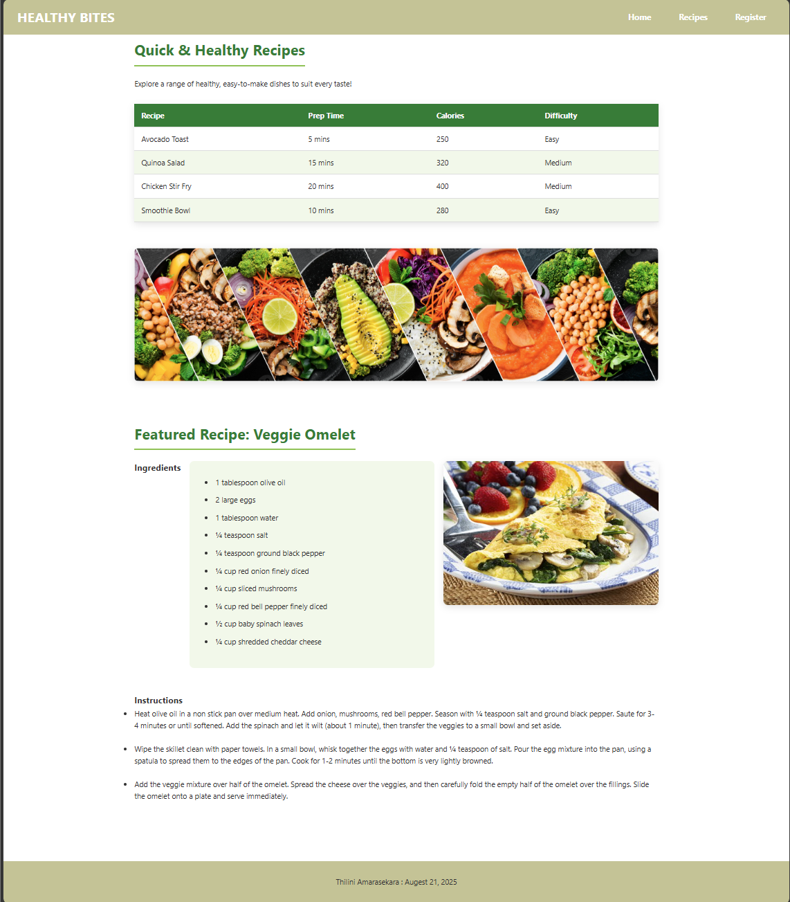
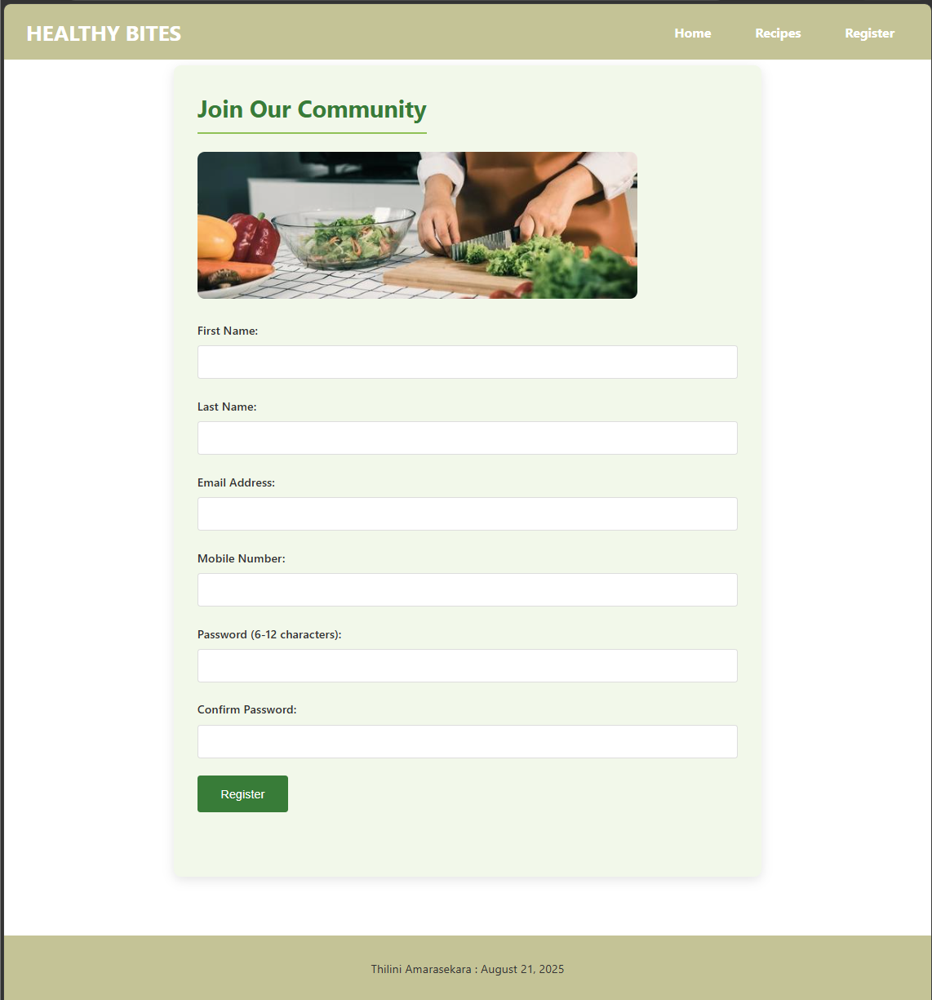

# Healthy Bites – QA Portfolio Project

Healthy Bites is a small website I created during my diploma to practise coding (HTML, CSS and Java).  
I used this project to show how I approach manual testing, write test cases, report bugs, and build simple automation.

This project represents my QA skills as a beginner learning automation.

---
## 🖼️ Preview

| Home | Recipes | Register |
|---|---|---|
|  |  |  |

---

## 🌱 What This Project Shows

- Manual testing on a real website  
- Clear test cases  
- Bug reports with steps and expected results  
- A simple test plan  
- A test summary  
- Basic automation (Selenium C#) – coming soon  
- Clean project structure  
- My ability to learn and improve

---

## 📄 Manual Testing Documents

All manual testing work is inside the **manual-testing** folder:

- **test-plan.md** – how I planned the testing  
- **test-cases.md** – positive, negative, UI, and cross‑browser cases  
- **bug-reports.md** – real bugs found during testing  
- **test-summary.md** – final results and recommendations  

These documents show how I think as a QA and how I test a simple website.

---

## 🧪 Automation (Coming Soon)

I will add beginner‑friendly Selenium C# tests in the **automation** folder.

The goal is to show:

- basic automation skills  
- page object model  
- simple test structure  
- clear naming  
- easy‑to‑run tests  

This will help me demonstrate that I understand automation basics and can learn new tools quickly.

---

## 🖥️ What the Website Includes

Healthy Bites is a static website with:

- Home page  
- Recipes page  
- Register page  
- Images, CSS, and JavaScript files  

I used this website to practise testing navigation, layout, form validation, and content.

---

## 🎯 Why I Built This Project

I built Healthy Bites to:

- practise real QA work  
- show my manual testing experience  
- learn automation step by step  
- create a clean project for my GitHub portfolio  
- demonstrate how I learn and improve  

---

## 👩‍💻 About Me

I am a junior QA with real manual testing experience.  
I am learning automation and enjoy improving my skills through small projects like this.

This project is part of my QA portfolio to help me grow into a QA Automation role.

